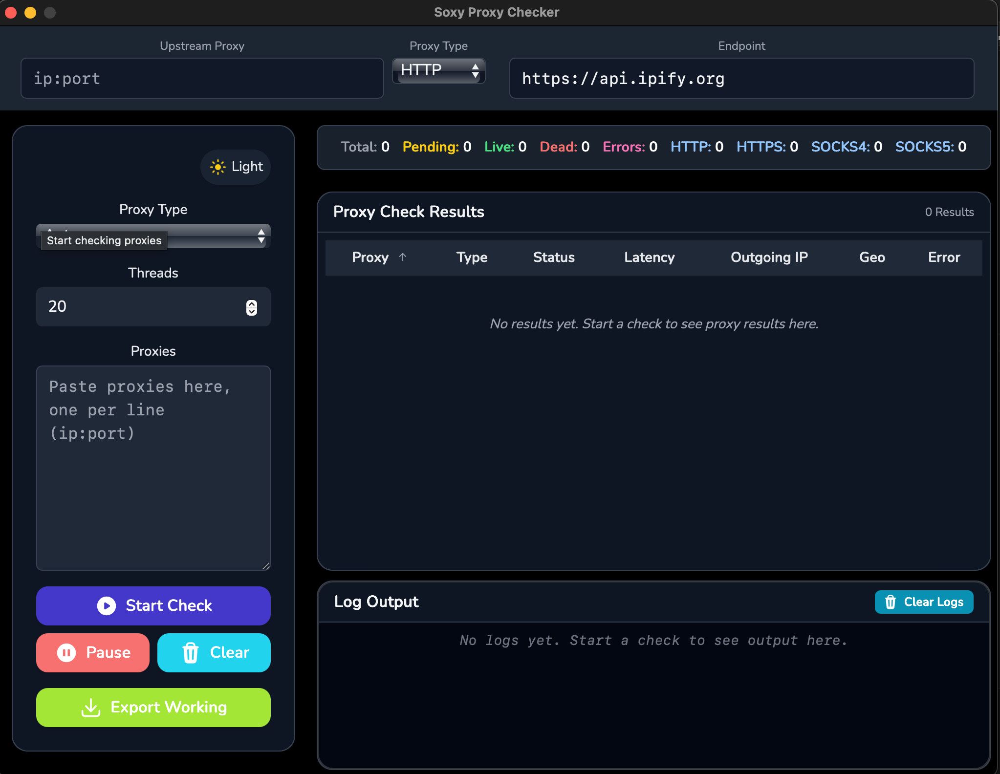

# SoxyChecker GUI

A powerful, cross-platform GUI application for checking and managing large lists of proxies with advanced features for privacy, performance, and usability.


## Screenshots


## 🚀 Features

### Core Functionality
- **Multi-Protocol Support**: HTTP, HTTPS, SOCKS4, SOCKS5, and automatic type detection
- **Bulk Proxy Checking**: Process thousands of proxies simultaneously with configurable threading
- **Real-time Results**: Live updates with detailed statistics and logging
- **Privacy Protection**: Route checks through upstream proxies to hide your real IP
- **Export Capabilities**: Export working proxies in multiple formats (TXT, CSV, JSON)

### Advanced Features
- **Custom Endpoints**: Configure custom check endpoints for specific use cases
- **Geolocation Support**: Optional IP geolocation for proxy results
- **Performance Metrics**: Detailed latency measurements and success rates
- **Configuration Management**: Persistent settings and preferences
- **Professional UI**: Clean, responsive interface with light/dark mode support

## 📋 Requirements

- **Operating System**: Windows 10+, macOS 10.13+, or Linux
- **Go**: Version 1.19 or higher
- **Node.js**: Version 16 or higher (for frontend development)
- **Wails**: Version 2.x

## 🛠️ Installation

### Pre-built Binaries
Download the latest release from the [Releases](https://github.com/r4j3sh-com/soxyCheckerGui/releases) page.

### Building from Source

1. **Install Wails CLI**:
```bash
go install github.com/wailsapp/wails/v2/cmd/wails@latest
```

2. **Clone the repository**:
```bash
git clone https://github.com/r4j3sh-com/soxyCheckerGui.git
cd soxyCheckerGui
```

3. **Install dependencies**:
```bash
# Backend dependencies
go mod tidy

# Frontend dependencies
cd frontend
npm install
cd ..
```

4. ***Build the application:***
```bash
# Development build
wails build

# Production build with optimizations
wails build -clean -upx
```

## Usage
### Basic Proxy Checking

***1.Launch the application***

***2.Select proxy type:***
- **Auto:** Automatically detect proxy type
- **HTTP/HTTPS:** For HTTP-based proxies
- **SOCKS4/SOCKS5:** For SOCKS proxies

***3. Input proxy list:***
- Paste proxies in `ip:port` format (one per line)
- Or import from file

***4.Configure settings:***
- Set thread count (recommended: 20-100)
- Choose check endpoint (default: https://api.ipify.org)
- Optionally configure upstream proxy

***5.Start checking:***
- Click "Start" to begin
- Monitor real-time progress and statistics
- Use "Stop" for graceful shutdown or "Force Stop" for immediate halt

### Advanced Configuration

***Custom Check Endpoints***
```bash
https://api.ipify.org   # IP detection
https://httpbin.org/ip  # Alternative IP service
custom-server.com:8080  # Custom TCP endpoint
```
***Upstream Proxy Configuration***

Route all proxy checks through an upstream proxy for additional privacy:
```bash
Format: ip:port
Example: 127.0.0.1:9050 (Tor)
         proxy.example.com:8080
```

***Threading Guidelines***
- **Low-end systems:** 10-20 threads
- **Mid-range systems:** 20-50 threads
- **High-end systems:** 50-100+ threads
- **Network considerations:** Adjust based on brandwidth and target server limits

### Export Options

Export working proxies in multiple formats:
- **Plain Text (.txt):** Simple `ip:port` format
- **CSV(.csv):** Structured data with headers
- **JSON(.json):** Machine-readable format with metadata

Export options include:
- Proxy type information
- Latency measurements
- Outgoing IP addresses
- Geolocation data (if enabled)

## Configuration
The application stores configuration in:
- **Windows:** `%APPDATA%/soxyCheckerGui/config.json`
- **macOS:** `~/Library/Application Support/soxyCheckerGui/config.json`
- **Linux:** `~/.config/soxyCheckerGui/config.json`

### Configuration Options
```json
{
  "lastProxyType": "auto",
  "lastEndpoint": "https://api.ipify.org",
  "lastThreadCount": 20,
  "lastUpstreamProxy": "",
  "defaultEndpoints": [
    "https://api.ipify.org",
    "https://httpbin.org/ip",
    "https://icanhazip.com"
  ],
  "maxThreads": 200,
  "theme": "light",
  "enableGeolocation": false,
  "exportFormat": "txt",
  "autoSaveResults": false
}
```
## 🏗️ Development
### Project Structure
```
soxyCheckerGui/
├── main.go                 # Application entry point
├── app2.go                 # Legacy app structure
├── backend/
│   ├── app.go             # Main application logic
│   ├── checker/           # Proxy checking engine
│   │   ├── manager.go     # Check orchestration
│   │   ├── protocols.go   # Protocol implementations
│   │   ├── auto_detect.go # Type detection
│   │   ├── upstream.go    # Upstream proxy support
│   │   ├── result.go      # Result structures
│   │   └── stats.go       # Statistics computation
│   └── config/
│       └── config.go      # Configuration management
├── frontend/              # React frontend
│   ├── src/
│   │   ├── components/    # React components
│   │   ├── App.jsx        # Main app component
│   │   └── styles/        # CSS/SCSS styles
│   └── package.json
├── build/                 # Build artifacts
└── wails.json            # Wails configuration
```
### Development Commands
```bash
# Start development server with hot reload
wails dev

# Build for development
wails build

# Build for production
wails build -clean -upx

# Run tests
go test ./...

# Frontend development (separate terminal)
cd frontend && npm run dev
```
### API Reference
***Backend Methods (Go -> Frontend)***
```
// Start proxy checking
StartCheck(params CheckParams) string

// Control operations
PauseCheck() string
ResumeCheck() string
StopCheck() string
ClearResults() string

// Data retrieval
GetWorkingProxies() []string
```

***Frontend Events (Frontend <- Backend)***
```
// Real-time updates
runtime.EventsOn('stats-update', handleStatsUpdate);
runtime.EventsOn('result-update', handleResultUpdate);
runtime.EventsOn('log-update', handleLogUpdate);
```

## 🤝 Contributing
1. Fork the repository
2. Create a feature branch (`git checkout -b feature/amazing-feature`)
3. Commit your changes (`git commit -m 'Add amazing feature`)
4. Push to the branch (`git push origin feature/amazing-feature`)
5. Open a Pull Request

### Development Guidelines
- Follow Go best practices and conventions
- Use React functional components with hooks
- Maintain consistent code formatting
- Add tests for new functionality
- Update documentation as needed

### 📝 License
This project is licensed under the MIT License - see the LICENSE file for details.

## 🙏 Acknowledgments

- [Wails](https://wails.io) - For the excellent Go + Web framework
- [React](https://react.dev) - For the powerful UI library
- [Heroicons](https://heroicons.com) - For the beautiful icons
- [Tailwind CSS](https://tailwindcss.com) - For the utility-first CSS framework

## 📞 Support
- **Issues**: [GitHub Issues](https://github.com/r4j3sh-com/soxyCheckerGui/issues)
- **Discussions**: [GitHub Discussions](https://github.com/r4j3sh-com/soxyCheckerGui/discussions) - Comming Soon
- **Documentation**: [Wiki](https://github.com/r4j3sh-com/soxyCheckerGui/wiki) - Comming Soon
- **LinkedIn**: [Connect with the developer](https://linkedin.com/in/r4j3sh)

## 🔒 Security
For security concerns, please visit [r4j3sh.com](https://r4j3sh.com) for contact information or create a private security advisory through GitHub's security tab instead of using the public issue tracker.
